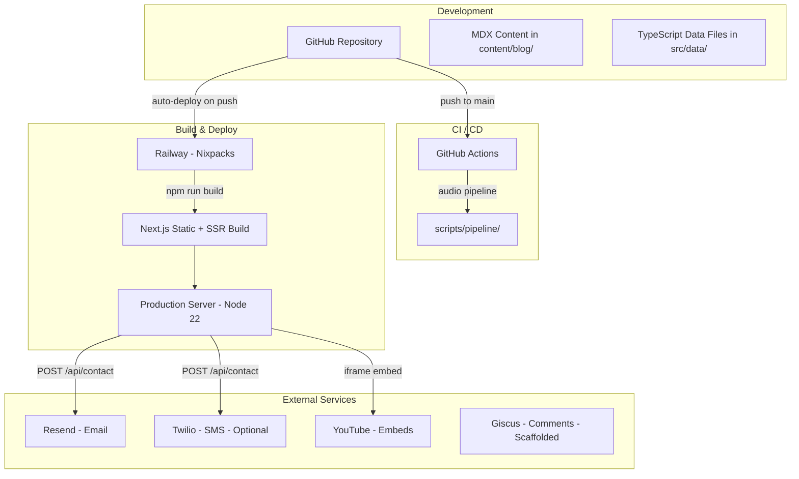
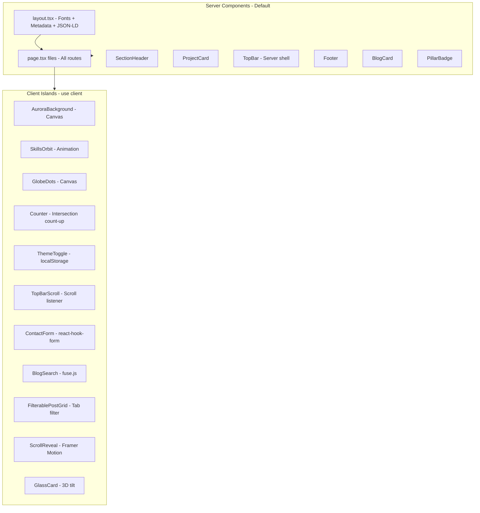
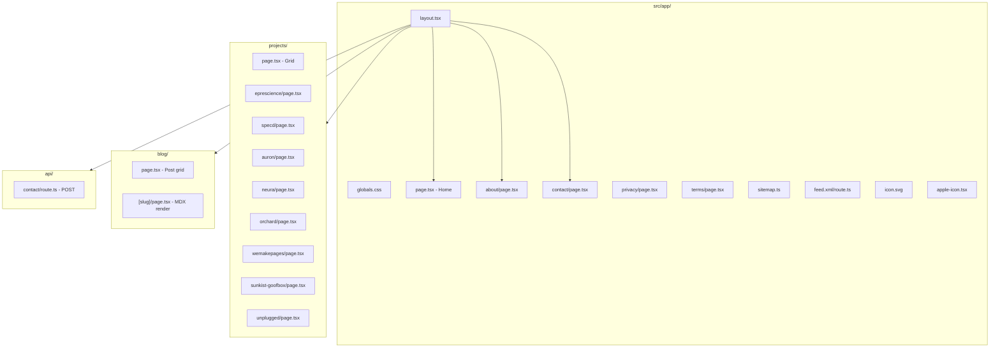
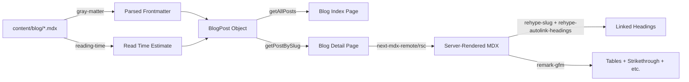
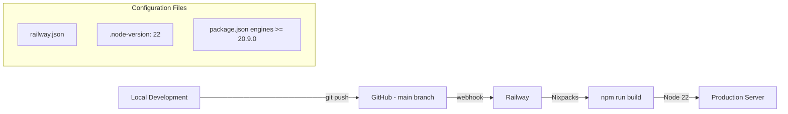
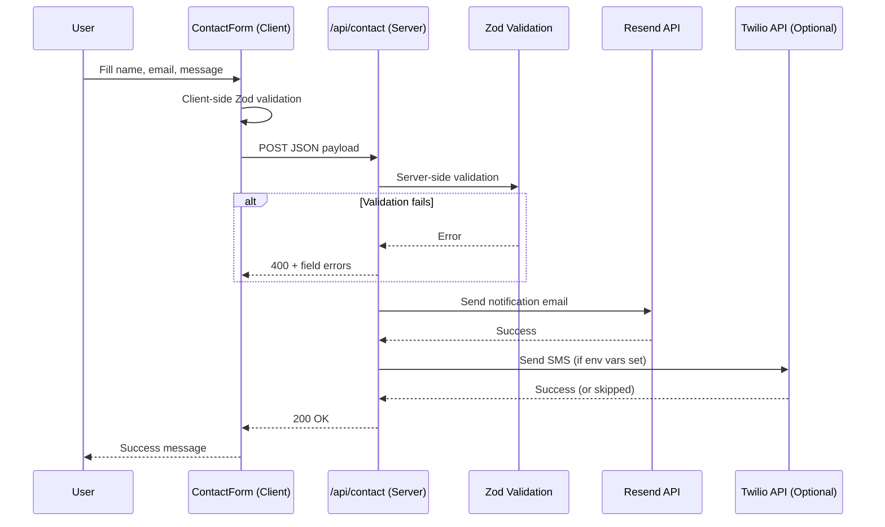
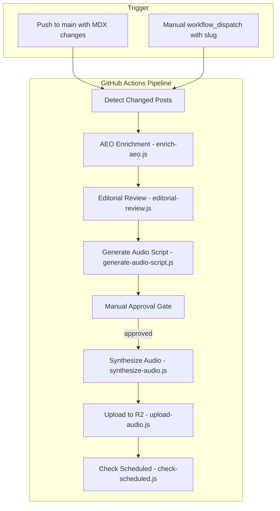

# Systems Architecture Reference

A comprehensive, reusable architecture template derived from the RMVS website (rmvs.org). Every layer — deployment, rendering, design system, component conventions, SEO/AEO, and quality assurance — is documented below with diagrams and specifications that can be applied to any modern marketing / portfolio / content site.

---

## Table of Contents

1. [High-Level System Diagram](#1-high-level-system-diagram)
2. [Rendering Architecture (Islands Pattern)](#2-rendering-architecture-islands-pattern)
3. [Application Layer Map](#3-application-layer-map)
4. [Component Architecture](#4-component-architecture)
5. [Design System Specification](#5-design-system-specification)
6. [Tailwind v4 Integration](#6-tailwind-v4-integration)
7. [Data Layer](#7-data-layer)
8. [SEO / AEO Infrastructure](#8-seo--aeo-infrastructure)
9. [Deployment Pipeline](#9-deployment-pipeline)
10. [Contact / Notification Flow](#10-contact--notification-flow)
11. [Audio Blog Pipeline (Scaffolding)](#11-audio-blog-pipeline-scaffolding)
12. [Quality Checklist](#12-quality-checklist)

---

## 1. High-Level System Diagram



### Key Characteristics

| Attribute | Value |
|-----------|-------|
| Framework | Next.js 16 (App Router) |
| Language | TypeScript 5, React 19 |
| Styling | Tailwind CSS v4 + CSS Custom Properties |
| Content | MDX (in-repo, no headless CMS) |
| Hosting | Railway (Nixpacks builder) |
| Node Version | 22 (pinned via `.node-version` + `engines` in `package.json`) |
| Domain | Custom domain via Railway |

---

## 2. Rendering Architecture (Islands Pattern)

All crawlable content is server-rendered. Interactivity is isolated into client-side "islands" — small `"use client"` components embedded within server-rendered pages.



### Rules

1. **Pages are always Server Components.** They import data, generate metadata, and render HTML.
2. **Client components are leaves.** They never fetch data or generate metadata.
3. **Server-rendered fallbacks** are provided for critical client content (e.g., `sr-only` skill lists behind `SkillsOrbit`, `noscript` tags).
4. **No `"use client"` on pages or layouts.** Only on individual interactive widgets.
5. **Canvas animations** (Aurora, Globe) use HTML5 Canvas 2D — no Three.js or WebGL.
6. **`prefers-reduced-motion`** is respected in every animated component.

---

## 3. Application Layer Map



### File Convention

| File | Purpose |
|------|---------|
| `layout.tsx` | Root layout: Google Fonts, global CSS, `AppShell`, JSON-LD org schema, theme boot `<script>`, RSS `<link>` |
| `page.tsx` | Route page (Server Component) |
| `route.ts` | API route handler (POST/GET) |
| `sitemap.ts` | Dynamic `MetadataRoute.Sitemap` |
| `icon.svg` | SVG favicon (auto-detected by Next.js) |
| `apple-icon.tsx` | Dynamic PNG via `ImageResponse` for iOS home screens |

---

## 4. Component Architecture

### Layout Components

| Component | Type | File | Purpose |
|-----------|------|------|---------|
| AppShell | Server | `src/components/AppShell.tsx` | Composes AuroraBackground + TopBar + children + Footer |
| TopBar | Server | `src/components/layout/TopBar.tsx` | Logo, nav links, ThemeToggle, CTA — server shell |
| TopBarScroll | Client | `src/components/layout/TopBarScroll.tsx` | Scroll listener toggles header background/blur |
| AuroraBackground | Client | `src/components/layout/AuroraBackground.tsx` | Full-viewport Canvas 2D aurora ribbons + particles |
| Footer | Server | `src/components/layout/Footer.tsx` | Links, legal, social icons, copyright year |

### Home Components

| Component | Type | File | Purpose |
|-----------|------|------|---------|
| SkillsOrbit | Client | `src/components/home/SkillsOrbit.tsx` | Concentric orbiting skill labels, `requestAnimationFrame` |
| GlobeDots | Client | `src/components/home/GlobeDots.tsx` | Canvas globe with location pins + label collision avoidance |
| Counter | Client | `src/components/home/Counter.tsx` | Count-up on viewport intersection, cubic easing |

### Shared Components

| Component | Type | File | Purpose |
|-----------|------|------|---------|
| SectionHeader | Server | `src/components/shared/SectionHeader.tsx` | Section label (small-caps) + title + optional description |
| ProjectCard | Server | `src/components/shared/ProjectCard.tsx` | Link card with status badge, tags, description |
| ThemeToggle | Client | `src/components/shared/ThemeToggle.tsx` | Dark/light toggle, `localStorage` + `data-theme` attribute |
| ScrollReveal | Client | `src/components/ScrollReveal.tsx` | Framer Motion scroll-in with `useInView` + `useReducedMotion` |
| GlassCard | Client | `src/components/GlassCard.tsx` | Frosted glass card with optional 3D tilt on hover |
| HeroBackground | Client | `src/components/HeroBackground.tsx` | Animated gradient orbs + mouse-driven parallax |
| ContactForm | Client | `src/components/ContactForm.tsx` | react-hook-form + Zod validation, POST to `/api/contact` |

### Blog Components

| Component | Type | File | Purpose |
|-----------|------|------|---------|
| BlogCard | Server | `src/components/blog/BlogCard.tsx` | Post preview link: date, read time, pillar, excerpt |
| PillarBadge | Server | `src/components/blog/PillarBadge.tsx` | Maps pillar name to CSS variable color |
| FilterablePostGrid | Client | `src/components/blog/FilterablePostGrid.tsx` | Tab filter by pillar + post grid |
| BlogSearch | Client | `src/components/blog/BlogSearch.tsx` | Fuse.js fuzzy search with Cmd+K modal |
| AudioPlayer | Client | `src/components/blog/AudioPlayer.tsx` | Audio playback with waveform + chapter support (scaffolded) |
| ShareButton | Client | `src/components/blog/ShareButton.tsx` | Web Share API or fallback dropdown (scaffolded) |
| Comments | Client | `src/components/blog/Comments.tsx` | Giscus integration (scaffolded) |

---

## 5. Design System Specification

### 5.1 Color Palette

All colors are defined as CSS custom properties in `src/styles/tokens.css` with automatic light-mode overrides via `[data-theme="light"]`.

#### Dark Mode (Default)

| Token | Value | Usage |
|-------|-------|-------|
| `--bg` | `#0a0f1c` | Page background |
| `--bg-card` | `rgba(13, 20, 36, 0.6)` | Card surfaces |
| `--cyan` | `#22d3ee` | Primary accent |
| `--cyan-dim` | `#06b6d4` | Secondary accent |
| `--cyan-glow` | `rgba(34, 211, 238, 0.12)` | Glow effects |
| `--cyan-subtle` | `rgba(34, 211, 238, 0.06)` | Subtle tints |
| `--cyan-border` | `rgba(34, 211, 238, 0.2)` | Accent borders |
| `--white` | `#e8edf4` | Body text |
| `--white-bright` | `#f0f6fc` | Headings |
| `--white-dim` | `rgba(136, 160, 185, 0.85)` | Muted text |
| `--white-faint` | `rgba(136, 160, 185, 0.12)` | Subtle fills |
| `--border` | `rgba(255, 255, 255, 0.06)` | Default borders |
| `--glass` | `rgba(15, 23, 42, 0.55)` | Glass surface |
| `--glass-border` | `rgba(255, 255, 255, 0.08)` | Glass borders |

#### Light Mode Overrides

| Token | Light Value |
|-------|-------------|
| `--bg` | `#f8fafc` |
| `--bg-card` | `rgba(255, 255, 255, 0.8)` |
| `--cyan` | `#0891b2` |
| `--cyan-dim` | `#0e7490` |
| `--white` | `#0f172a` |
| `--white-bright` | `#020617` |
| `--white-dim` | `rgba(51, 65, 85, 0.85)` |
| `--glass` | `rgba(255, 255, 255, 0.7)` |
| `--glass-border` | `rgba(0, 0, 0, 0.06)` |

#### Theme-Aware Component Tokens

These exist specifically to prevent the dark-on-dark bug in light mode. Every component background MUST use these instead of raw `rgba()` values.

| Token | Dark Value | Light Value | Used By |
|-------|-----------|-------------|---------|
| `--panel-bg` | `linear-gradient(160deg, rgba(20,28,44,0.9), rgba(13,20,36,0.95))` | `linear-gradient(160deg, rgba(241,245,249,0.95), rgba(226,232,240,0.98))` | `.panel`, glass cards |
| `--header-bg` | `linear-gradient(180deg, rgba(10,15,28,0.85), rgba(10,15,28,0.75))` | `linear-gradient(180deg, rgba(248,250,252,0.92), rgba(248,250,252,0.85))` | `.site-header`, TopBarScroll |
| `--input-bg` | `linear-gradient(180deg, rgba(15,23,42,0.8), rgba(10,15,25,0.9))` | `linear-gradient(180deg, rgba(255,255,255,0.9), rgba(241,245,249,0.95))` | Inputs, textareas, selects |
| `--input-shadow` | `inset 0 2px 4px rgba(0,0,0,0.2)` | `inset 0 2px 4px rgba(0,0,0,0.04)` | Input focus states |
| `--code-bg` | `rgba(10, 15, 28, 0.8)` | `rgba(241, 245, 249, 0.95)` | Code blocks, `<pre>` |

> **CRITICAL RULE:** Never use hardcoded `rgba(10, 15, 28, ...)` or similar dark background values anywhere in CSS or inline styles. Always reference a `var(--token)`. Hardcoded dark colors bypass `[data-theme="light"]` overrides and create unreadable dark-text-on-dark-background in light mode.

### 5.2 Typography

| Property | Value |
|----------|-------|
| Primary Font | DM Sans (Google Fonts) — `--font-sans` |
| Monospace Font | JetBrains Mono (Google Fonts) — `--font-mono` |
| Weights loaded | 400, 500, 600, 700, 800 (DM Sans); 400, 500, 600 (JetBrains Mono) |
| Body line-height | 1.7 |
| Font smoothing | `-webkit-font-smoothing: antialiased` + `-moz-osx-font-smoothing: grayscale` |
| Text rendering | `optimizeLegibility` |
| `font-display` | `swap` (via `next/font/google`) |

### 5.3 Spacing Scale

| Token | Value |
|-------|-------|
| `--space-xs` | 4px |
| `--space-sm` | 8px |
| `--space-md` | 16px |
| `--space-lg` | 24px |
| `--space-xl` | 40px |
| `--space-2xl` | 60px |
| `--space-3xl` | 80px |

### 5.4 Border Radius

| Token | Value |
|-------|-------|
| `--radius-sm` | 8px |
| `--radius-md` | 12px |
| `--radius-lg` | 16px |
| `--radius-xl` | 20px |
| `--radius-full` | 999px |

### 5.5 Shadows

| Token | Value |
|-------|-------|
| `--shadow-sm` | `0 4px 12px rgba(0,0,0,0.2)` |
| `--shadow-md` | `0 16px 40px rgba(0,0,0,0.35)` |
| `--shadow-lg` | `0 24px 60px rgba(0,0,0,0.5)` |
| `--shadow-glow` | `0 0 30px var(--cyan-glow), 0 8px 32px rgba(0,0,0,0.3)` |

### 5.6 Gradients

| Token | Value | Usage |
|-------|-------|-------|
| `--gradient-primary` | `linear-gradient(135deg, var(--cyan), var(--cyan-dim))` | CTA buttons, logos |
| `--gradient-glass` | `linear-gradient(140deg, rgba(34,211,238,0.06), rgba(15,23,42,0.85))` | Glass overlays |
| `--gradient-heading` | `linear-gradient(135deg, #f0f6fc 20%, #22d3ee 80%)` | Hero heading text |

### 5.7 Motion Tokens

| Token | Value | Notes |
|-------|-------|-------|
| `--duration-instant` | 100ms | Hover states |
| `--duration-fast` | 150ms | Micro-interactions |
| `--duration-normal` | 300ms | Standard transitions |
| `--duration-slow` | 500ms | Page transitions |
| `--duration-slower` | 700ms | Complex animations |
| `--ease-default` | `cubic-bezier(0.4, 0, 0.2, 1)` | General purpose |
| `--ease-bounce` | `cubic-bezier(0.34, 1.56, 0.64, 1)` | Playful interactions |
| `--ease-smooth` | `cubic-bezier(0.25, 0.1, 0.25, 1)` | Elegant transitions |
| `--stagger-delay` | 50ms | Staggered list reveal |
| `--reveal-distance` | 30px | Scroll reveal offset |

All motion tokens are set to `0` under `@media (prefers-reduced-motion: reduce)`.

### 5.8 Z-Index Layers

| Token | Value | Usage |
|-------|-------|-------|
| `--z-base` | 0 | Default content |
| `--z-elevated` | 10 | Floating elements |
| `--z-header` | 100 | Sticky header |
| `--z-dock` | 1000 | Dock navigation (if present) |
| `--z-modal` | 2000 | Modals, overlays |

### 5.9 Blur

| Token | Value |
|-------|-------|
| `--blur-sm` | 4px |
| `--blur-md` | 12px |
| `--blur-lg` | 24px |
| `--blur-xl` | 40px |

---

## 6. Tailwind v4 Integration

Tailwind v4 is configured **without** a `tailwind.config.js` file. The entire integration lives in three files:

### PostCSS Config

```js
// postcss.config.mjs
export default {
  plugins: {
    "@tailwindcss/postcss": {},
  },
};
```

### Global CSS Entry

```css
/* src/app/globals.css */
@import "tailwindcss";
@import "../styles/tokens.css";
@import "../styles/motion.css";

@plugin "@tailwindcss/typography";

@theme {
  --color-bg: #0a0f1c;
  --color-cyan: #22d3ee;
  --color-cyan-dim: #06b6d4;
  /* ... all design tokens exposed to Tailwind utilities */

  --font-sans: "DM Sans", ui-sans-serif, system-ui, sans-serif;
  --font-mono: "JetBrains Mono", ui-monospace, monospace;

  --radius-sm: 8px;
  --radius-md: 12px;
  --radius-lg: 16px;
  --radius-xl: 20px;
}
```

### Coexistence Pattern

- **CSS Custom Properties** (`var(--token)`) are used in component styles and inline styles for theme-awareness.
- **Tailwind utility classes** (`rounded-xl`, `shadow-2xl`, `flex`, `gap-12`, etc.) are used for layout and presentational styling.
- Both systems reference the same underlying values — Tailwind's `@theme` block mirrors the tokens in `tokens.css`.
- Custom CSS classes (`.section`, `.container`, `.hero`, `.badge`, `.btn`, `.panel`, `.glass-card`, etc.) are defined in `globals.css` for complex, reusable patterns that would be verbose as utility strings.

---

## 7. Data Layer

### 7.1 Static Data Files (`src/data/`)

#### Projects (`projects.ts`)

```typescript
interface Project {
  title: string;
  slug: string;         // Maps to src/app/projects/[slug]/page.tsx
  description: string;
  badge: string;        // e.g., "EdTech", "Medical AI", "Web Agency"
  status: "live" | "development" | "prototype" | "planning";
  statusLabel: string;  // Display text, e.g., "Live", "In Development"
  tags: string[];       // Tech stack tags
}
```

#### Locations (`locations.ts`)

```typescript
interface Location {
  city: string;
  country: string;
  flag: string;     // Emoji
  role: string;     // e.g., "Headquarters", "Tech Partners"
  lat: number;
  lng: number;
  isHQ?: boolean;
}
```

#### Skills (`skills.ts`)

```typescript
interface SkillCategory {
  name: string;
  orbit: "inner" | "middle" | "outer";
  skills: string[];
}
```

### 7.2 Blog System



#### Blog Post Frontmatter Schema

```yaml
title: "Post Title"
date: "2025-03-28"
updated: "2025-03-29"        # Optional
excerpt: "Short description"
pillar: "Build Log"          # Category: Build Log | Architecture | Tool Review | Methodology | Industry
tags: ["tag1", "tag2"]
author: "Rory Monaghan"
audio:                       # Optional audio version
  published: false
  url: ""
  duration: ""
  chapters: []
seo:                         # Optional AEO overrides
  description: "Custom meta description"
  keywords: ["keyword1"]
questions_answered:           # For FAQPage JSON-LD
  - "What is X?"
  - "How does Y work?"
```

#### MDX Processing Stack

| Package | Role |
|---------|------|
| `gray-matter` | Parse YAML frontmatter from MDX files |
| `reading-time` | Estimate read time from content |
| `next-mdx-remote/rsc` | Server-side MDX compilation (React Server Components) |
| `remark-gfm` | GitHub Flavored Markdown (tables, strikethrough, task lists) |
| `rehype-slug` | Add `id` attributes to headings |
| `rehype-autolink-headings` | Wrap headings in anchor links |
| Custom MDX components | Styled `<pre>`, `<code>`, `<a>`, `<table>`, `<blockquote>` in `src/lib/mdx.tsx` |

---

## 8. SEO / AEO Infrastructure

### 8.1 Metadata Pattern

Root layout defines default metadata with a template:

```typescript
export const metadata: Metadata = {
  metadataBase: new URL("https://www.example.com"),
  title: {
    default: "Site Name | Tagline",
    template: "%s | Site Name",
  },
  description: "...",
  keywords: ["..."],
  authors: [{ name: "...", url: "..." }],
  openGraph: { type: "website", locale: "en_US", images: ["/og-default.png"] },
  twitter: { card: "summary_large_image" },
  robots: { index: true, follow: true, googleBot: { index: true, follow: true } },
  alternates: { canonical: "https://www.example.com" },
};
```

Dynamic pages use `generateMetadata`:

```typescript
export async function generateMetadata({ params }: Props): Promise<Metadata> {
  const post = getPostBySlug(slug);
  return { title: post.title, description: post.excerpt, /* ... */ };
}
```

### 8.2 JSON-LD Structured Data

Six schema builders in `src/lib/structured-data.ts`:

| Schema | Placement | Trigger |
|--------|-----------|---------|
| Organization | Root layout `<head>` | Every page |
| Person | About page `<head>` | `/about` |
| TechArticle | Blog post `<head>` | `/blog/[slug]` |
| FAQPage | Blog post `<head>` | When `questions_answered` exists in frontmatter |
| Blog | Blog index `<head>` | `/blog` |
| SoftwareApplication | Project pages `<head>` | `/projects/[slug]` |

### 8.3 Sitemap

`src/app/sitemap.ts` generates `sitemap.xml` by combining:

1. **Static pages** — home, about, projects, blog, contact, privacy, terms (with priority weights)
2. **Project pages** — from a hardcoded slug list
3. **Blog posts** — from `getAllPosts()`, using `post.date` / `post.updated` for `lastModified`

### 8.4 RSS Feed

`src/app/feed.xml/route.ts` serves RSS 2.0 with iTunes podcast extensions:

- `<enclosure>` for audio blog posts (when `audio.published` is true)
- `<itunes:duration>`, `<itunes:author>`, `<itunes:category>`
- Cache: `public, max-age=3600, s-maxage=3600`

### 8.5 LLM Discovery Files

| File | Purpose |
|------|---------|
| `public/llms.txt` | Structured plain-text summary of the organization, products, capabilities, and contact info for LLM training/retrieval |
| `public/ai.txt` | Machine-readable agent instructions: sitemap URL, RSS URL, llms.txt URL, key page URLs, structured data notice |

### 8.6 Theme Boot Script (FOUC Prevention)

An inline `<script>` in the root layout `<head>` runs before paint to apply the saved theme:

```html
<script>
(function(){
  try {
    var t = localStorage.getItem('rmvs-theme');
    if (t === 'light') document.documentElement.setAttribute('data-theme', 'light');
  } catch(e) {}
})()
</script>
```

This prevents a flash of the wrong theme on page load. The `ThemeToggle` client component syncs `localStorage` and the `data-theme` attribute on toggle.

---

## 9. Deployment Pipeline



### Railway Configuration (`railway.json`)

```json
{
  "$schema": "https://railway.com/railway.schema.json",
  "build": { "builder": "NIXPACKS" },
  "deploy": {
    "runtime": "V2",
    "numReplicas": 1,
    "restartPolicyType": "ON_FAILURE",
    "restartPolicyMaxRetries": 10
  }
}
```

### Node Version Pinning

Two files ensure the correct Node.js version:

| File | Content | Purpose |
|------|---------|---------|
| `.node-version` | `22` | Nixpacks reads this to select Node version |
| `package.json` `engines` | `"node": ">=20.9.0"` | Next.js build-time validation |

### Environment Variables

| Variable | Required | Service | Purpose |
|----------|----------|---------|---------|
| `RESEND_API_KEY` | Yes | Resend | Email sending for contact form |
| `EMAIL_FROM` | Yes | Resend | Sender address |
| `NOTIFY_EMAIL` | Yes | Internal | Recipient for contact notifications |
| `TWILIO_ACCOUNT_SID` | No | Twilio | SMS account (optional) |
| `TWILIO_AUTH_TOKEN` | No | Twilio | SMS auth (optional) |
| `TWILIO_FROM_NUMBER` | No | Twilio | SMS sender (optional) |
| `TWILIO_TO_NUMBER` | No | Twilio | SMS recipient (optional) |

---

## 10. Contact / Notification Flow



### Form Stack

| Layer | Technology |
|-------|-----------|
| UI | `react-hook-form` with controlled inputs |
| Validation | `zod` schema + `@hookform/resolvers` |
| API | Next.js Route Handler (`POST`) |
| Email | Resend SDK (`resend` package) |
| SMS | Twilio REST API via `fetch` (optional, no SDK) |

---

## 11. Audio Blog Pipeline (Scaffolding)



### Pipeline Scripts (`scripts/pipeline/`)

| Script | Status | Purpose |
|--------|--------|---------|
| `enrich-aeo.js` | Scaffolded | Add SEO/AEO metadata to frontmatter |
| `editorial-review.js` | Scaffolded | Automated editorial checks |
| `generate-audio-script.js` | Scaffolded | Claude API: MDX to audio script |
| `synthesize-audio.js` | Scaffolded | ElevenLabs TTS synthesis |
| `upload-audio.js` | Scaffolded | Upload MP3 to Cloudflare R2 |
| `check-scheduled.js` | Scaffolded | Daily check for publishable posts |
| `move-to-published.js` | Scaffolded | Transition scheduled to published |
| `notify-review.js` | Scaffolded | Slack webhook notification |
| `distribute.js` | Scaffolded | Cross-post to Dev.to / Hashnode |

---

## 12. Quality Checklist

A reusable pre-launch checklist for any site built with this architecture.

### Responsive & Cross-Platform

- [ ] Test on mobile (375px), tablet (768px), desktop (1440px)
- [ ] Test in Instagram / Twitter in-app browsers
- [ ] Verify `overflow-x: hidden` on `html` AND `body`
- [ ] Confirm no horizontal scroll on any page at any viewport
- [ ] Test all Canvas animations on low-power devices

### Dark / Light Mode

- [ ] Every component background uses `var(--token)`, never hardcoded `rgba()`
- [ ] Test full site in dark mode (default)
- [ ] Test full site in light mode
- [ ] Verify no dark-text-on-dark-background or light-text-on-light-background
- [ ] Theme toggle persists across page navigation and refresh
- [ ] No FOUC (flash of unstyled content / wrong theme) on load

### Accessibility & Motion

- [ ] All animated components respect `prefers-reduced-motion: reduce`
- [ ] Canvas elements have `aria-hidden="true"`
- [ ] Decorative client components have server-rendered `sr-only` fallbacks
- [ ] All images have meaningful `alt` text
- [ ] All links have distinguishable text (no naked URLs)
- [ ] Color contrast meets WCAG AA (4.5:1 for body text)

### Favicon & Branding

- [ ] `src/app/icon.svg` exists (SVG favicon)
- [ ] `src/app/apple-icon.tsx` exists (dynamic PNG for iOS)
- [ ] `/og-default.png` exists (1200x630 Open Graph image)
- [ ] Link preview renders correctly on Twitter, LinkedIn, Slack, iMessage

### SEO / AEO

- [ ] Root `metadata` has title, description, keywords, OG, Twitter card
- [ ] Every page has unique `<title>` via template or `generateMetadata`
- [ ] JSON-LD Organization schema in root layout
- [ ] JSON-LD on every content page (Article, Software, Person, FAQ as appropriate)
- [ ] `sitemap.xml` includes all pages, projects, and blog posts
- [ ] `feed.xml` validates as RSS 2.0
- [ ] `public/llms.txt` is accurate and up-to-date
- [ ] `public/ai.txt` points to sitemap, RSS, and llms.txt
- [ ] `robots` meta allows indexing and following
- [ ] Canonical URLs are set correctly

### Performance

- [ ] Lighthouse Performance score > 90
- [ ] Lighthouse Accessibility score > 90
- [ ] No Three.js / WebGL (Canvas 2D only for animations)
- [ ] Images use `next/image` with `priority` on above-the-fold content
- [ ] Fonts use `next/font/google` with `display: swap`
- [ ] No layout shift from client component hydration

### Deployment

- [ ] `railway.json` specifies NIXPACKS builder
- [ ] `.node-version` matches the required Node version
- [ ] `package.json` `engines` field matches
- [ ] All required env vars are set in Railway dashboard
- [ ] `git push origin main` triggers successful auto-deploy
- [ ] Custom domain DNS is configured and SSL active

---

## File Structure Summary

```
project-root/
├── .github/workflows/        # CI pipelines (audio blog)
├── .node-version             # Node version for Nixpacks (22)
├── content/blog/             # MDX blog posts
├── docs/
│   └── ARCHITECTURE.md       # This document
├── public/
│   ├── ai.txt                # LLM agent discovery
│   ├── llms.txt              # LLM training summary
│   ├── images/               # Static images (founder photos, etc.)
│   └── og-default.png        # Default Open Graph image
├── scripts/pipeline/         # Audio blog pipeline scripts
├── src/
│   ├── app/
│   │   ├── layout.tsx        # Root layout (fonts, metadata, AppShell)
│   │   ├── globals.css       # Tailwind + tokens + global styles
│   │   ├── page.tsx          # Homepage
│   │   ├── icon.svg          # Favicon
│   │   ├── apple-icon.tsx    # Dynamic Apple icon
│   │   ├── sitemap.ts        # Dynamic sitemap
│   │   ├── feed.xml/route.ts # RSS feed
│   │   ├── api/contact/      # Contact form API
│   │   ├── about/            # About page
│   │   ├── blog/             # Blog index + [slug]
│   │   ├── contact/          # Contact page
│   │   ├── privacy/          # Privacy policy
│   │   ├── projects/         # Projects index + per-project pages
│   │   └── terms/            # Terms of use
│   ├── components/
│   │   ├── AppShell.tsx      # Global layout wrapper
│   │   ├── layout/           # TopBar, Footer, Aurora, TopBarScroll
│   │   ├── home/             # SkillsOrbit, GlobeDots, Counter
│   │   ├── shared/           # SectionHeader, ProjectCard, ThemeToggle
│   │   └── blog/             # BlogCard, PillarBadge, FilterablePostGrid, etc.
│   ├── data/                 # Static data (projects, locations, skills)
│   ├── lib/                  # Utilities (blog, mdx, structured-data, email, sms, forms, motion)
│   └── styles/
│       ├── tokens.css        # Design tokens (dark + light + reduced-motion)
│       └── motion.css        # Animation keyframes and utilities
├── .env.example              # Environment variable template
├── next.config.ts            # Next.js config
├── package.json              # Dependencies and scripts
├── postcss.config.mjs        # Tailwind v4 PostCSS plugin
├── railway.json              # Railway deployment config
└── tsconfig.json             # TypeScript strict config with @/* paths
```
